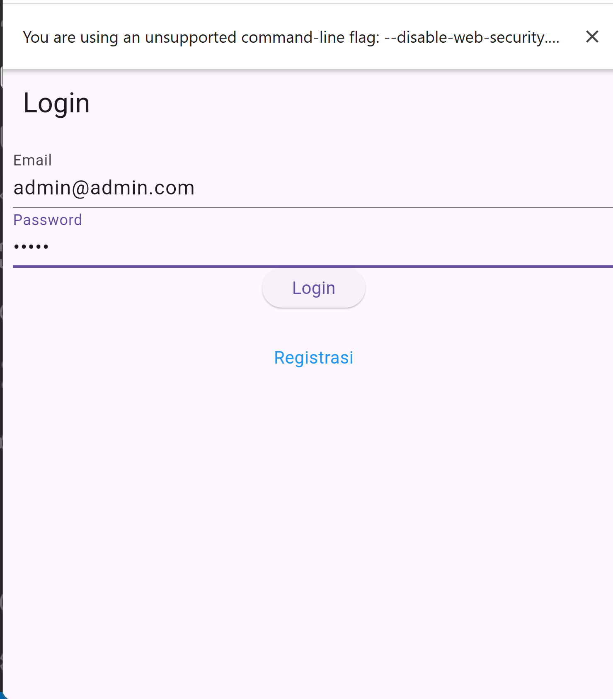
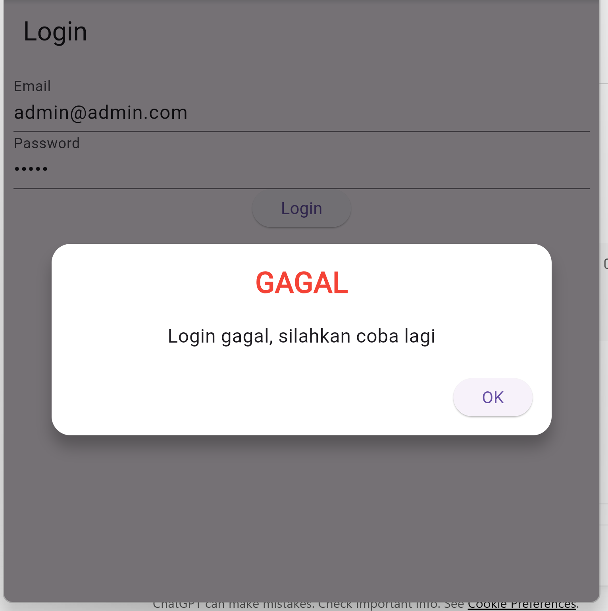

# Nama: Prasetyo Angga Permana  
# NIM: H1D023028  
# Shift KRS: A  
# Shift Baru: A

---

# Aplikasi Flutter – Login, Registrasi, dan CRUD Produk

Aplikasi ini dibuat menggunakan:
- Flutter
- Backend API CodeIgniter 4
- REST API (Login, Registrasi, CRUD Produk)

Aplikasi ini mendukung proses autentikasi dan pengelolaan produk.

# --- DOKUMENTASI ---


https://github.com/user-attachments/assets/2a5cb65c-3384-4ebb-9add-9d399a8d26b2

#---


# 1. Proses Login

## a. Halaman Login
User memasukkan email dan password, lalu menekan tombol Login. Aplikasi mengirim data ke API CodeIgniter untuk diverifikasi.



## b. Jika Login Gagal
Pada percobaan awal API belum tersambung sehingga aplikasi memunculkan dialog WarningDialog. Setelah API diperbaiki, dialog tidak lagi muncul.



### Potongan Kode Login
```dart
LoginBloc.login(
  email: _emailTextboxController.text,
  password: _passwordTextboxController.text,
).then((value) async {
  if (value.code == 200) {
    await UserInfo().setToken(value.token.toString());
    await UserInfo().setUserID(int.parse(value.userID.toString()));
    Navigator.pushReplacement(
      context,
      MaterialPageRoute(builder: (context) => const ProdukPage()),
    );
  } else {
    showDialog(
      context: context,
      builder: (context) => const WarningDialog(
        description: "Login gagal, silahkan coba lagi",
      ),
    );
  }
}); ```
```
# 2 Proses Registrasi
## Halaman Registrasi
Kode Registrasi```
RegistrasiBloc.registrasi(
  nama: _namaTextboxController.text,
  email: _emailTextboxController.text,
  password: _passwordTextboxController.text,
).then((value) {
  showDialog(
    context: context,
    builder: (context) => SuccessDialog(
      description: "Registrasi berhasil, silahkan login",
    ),
  );
});```

# 3 Halaman List Produk
Halaman ini menampilkan daftar produk yang diambil dari API.
FutureBuilder untuk List Produk```
body: FutureBuilder<List>(
  future: ProdukBloc.getProduks(),
  builder: (context, snapshot) {
    return snapshot.hasData
        ? ListProduk(list: snapshot.data)
        : const Center(child: CircularProgressIndicator());
  },
),```

# 4 Proses Tambah Produk
## a. Form Tambah Produk

User mengisi kode produk, nama produk, dan harga kemudian menekan tombol Simpan.

Kode Simpan Produk
```Produk createProduk = Produk(id: null);
createProduk.kodeProduk = _kodeProdukTextboxController.text;
createProduk.namaProduk = _namaProdukTextboxController.text;
createProduk.hargaProduk = int.parse(_hargaProdukTextboxController.text);

ProdukBloc.addProduk(produk: createProduk);```
```
# 5. Proses Edit Produk

##Ketika user klik Edit, aplikasi membuka form dengan data lama.
Kode Ubah Produk
```
Produk updateProduk = Produk(id: widget.produk!.id!);
updateProduk.kodeProduk = _kodeProdukTextboxController.text;
updateProduk.namaProduk = _namaProdukTextboxController.text;
updateProduk.hargaProduk = int.parse(_hargaProdukTextboxController.text);

ProdukBloc.updateProduk(produk: updateProduk);```
```

# 6. Proses Hapus Produk 
##Popup Konfirmasi

Aplikasi menampilkan dialog konfirmasi hapus sebelum menghapus data.
Kode Hapus Produk
```
ProdukBloc.deleteProduk(id: int.parse(widget.produk!.id!)).then((value) {
  Navigator.of(context).push(
    MaterialPageRoute(builder: (context) => const ProdukPage()),
  );
});```
```

# 7. Logout
## User dapat melakukan logout melalui menu Drawer.
Kode Logout
```
await LogoutBloc.logout().then((value) {
  Navigator.of(context).pushAndRemoveUntil(
    MaterialPageRoute(builder: (context) => LoginPage()),
    (route) => false,
  );
});
```

# 8. Setting API URL di Flutter
## File: lib/helpers/api_url.dart
```
class ApiUrl {
  static const String baseUrl = "http://192.168.1.15:8080";

  static const String login = "$baseUrl/login";
  static const String registrasi = "$baseUrl/registrasi";

  static const String produk = "$baseUrl/produk";
  static String updateProduk(int id) => "$baseUrl/produk/$id";
  static String deleteProduk(int id) => "$baseUrl/produk/$id";
}
```

# 9. Cara Menjalankan
## Backend CodeIgniter 4
``php spark serve --host 192.168.1.15 --port 8080``

## Flutter Web (Chrome)
Chrome membutuhkan flag untuk mengizinkan request API (CORS)
``flutter run -d chrome --web-browser-flag="--disable-web-security"``
